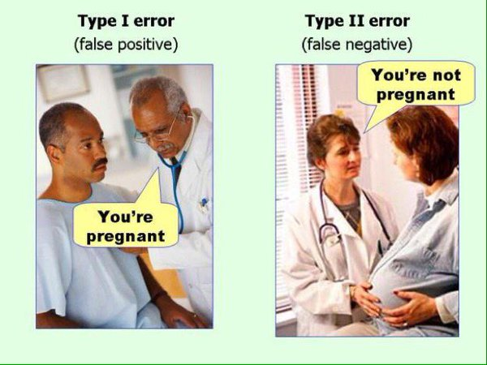

```{r setup, cache=FALSE, include=FALSE}
source("setup_knitr_slides.R")
op <- par(no.readonly = TRUE)
library(xtable)
## O pacote printr já configura o formato de saída de muitas funções
## como head(), table(), etc, sem a necessidade de usar a função
## knitr::kable(). Veja: https://yihui.name/printr
loadNamespace("printr")
## Para desabilitar, use
## unloadNamespace("printr")
```

# Introdução

### Inferência estatística

Na **inferência estatística** os dois principais objetivos são:

- **Estimar** um parâmetro populacional
  - Estimativa pontual
  - Estimativa intervalar
- **Testar** uma hipótese ou afirmativa sobre um parâmetro populacional

### Testes de hipótese

#### Hipótese
É uma afirmativa sobre uma propriedade da população

#### Teste de hipótese
- É um procedimento para se testar uma afirmativa sobre uma
propriedade da população
- Permite tomar **decisões** sobre a população com base em
informações de dados amostrais.

### Exemplo 8.1

Suponha que, entre pessoas sadias, a concentração de certa substância no
sangue se comporta segundo um modelo Normal com média 14 unidades/ml e
desvio padrão 6 unidades/ml.

Pessoas sofrendo de uma doença específica tem concentração média da
substância alterada para 18 unidades/ml.

Admitimos que o modelo Normal com desvio padrão 6 unidades/ml, continua
representado de forma adequada a concentração da substância em pessoas
com a doença.

### Exemplo 8.1

```{r sadio-doente, fig.width=7, fig.height=5, out.width='80%'}
dnorm1 <- function(x) {dnorm(x, mean = 14, sd = 6)}
dnorm2 <- function(x) {dnorm(x, mean = 18, sd = 6)}
curve(dnorm1, from = -10, to = 40, col = "green",
      ylab = "", xlab = "Concentração no sangue", axes = FALSE)
axis(1, at = c(14, 18))
box()
abline(v = 14, lty = 2, col = "green")
curve(dnorm2, from = -10, to = 40, add = TRUE, col = "red")
abline(v = 18, lty = 2, col = "red")
legend("topright", legend = c("Sadio", "Doente"),
       lty = 1, col = c("green", "red"))
```

### Exemplo 8.1

Para averiguar se um tratamento é eficaz contra a doença, selecionamos
uma amostra de 30 indivíduos **submetidos ao tratamento**.

Assumimos que todos os elementos da amostra $X_1, \ldots, X_{30}$ possuem
a mesma distribuição: $X_i \sim \text{N}(\mu, 36)$, onde:

  - $\mu = 14$ se o tratamento for eficiente
  - $\mu = 18$ se o tratamento não for eficiente

Se a média da amostra for próxima de 14, temos **evidências** de que o
tratamento é eficaz. Se for mais próxima de 18, as **evidências** são
contrárias ao tratamento.

Então a pergunta é: o quão próximo é **"próximo"**?

### Exemplo 8.2

Deseja-se estudar a tolerância de um equipamento eletrônico ao número de
impactos termo-elétricos.

Pelas características de fabricação do equipamento, é possível admitir
que a probabilidade de falha seja constante, isto é, após cada impacto,
existe uma probabilidade $p$ que ele falhe.

Representando por $X$ a variável número de impactos anteriores à falha,
pretende-se verificar se o modelo Geométrico com $p = 0.4$ é adequado
para caracterizar essa variável.

# Teste para a Média Populacional

## Variância conhecida

### Exemplo 8.1 continuação

- Interesse geral $\mu = 14$?
- Distribuição da média amostral para $n = 30$: $\text{N}(\mu, 36/30)$.
- Critério para decidir sobre o valor de $\mu$.
- **Valor crítico**, digamos $x_c$ tal que se a média amostral
($\bar{x}_{obs}$) for maior que $x_c$ concluímos que a amostra pertence
a população com média $18$.
- Como $\bar{X}$ é uma variável aleatória, devem existir erros
  associados.

### Tipos de hipóteses

#### Hipótese nula $H_0$
É uma afirmativa de que o valor de um parâmetro populacional é
**igual** a algum valor especificado. (O termo *nula* é
usado para indicar nenhuma mudança, nenhum efeito).

- No ex. 8.1 temos: $\mu = 14$ unidades/ml
- No ex. 8.2 temos: $p = 0,4$

#### Hipótese alternativa $H_a$
É uma afirmativa de que o parâmetro tem um valor, que, de alguma
forma, difere da hipótese nula. Ex.:

- $p \neq 0,4$ \qquad $p < 0,4$ \qquad $p > 0,4$

### Tipos de hipóteses

Quando fazemos um teste de hipótese, chegamos a um dos dois
possíveis resultados:

- **Rejeitar $H_0$**: em favor da hipótese alternativa $H_a$
- **Não rejeitar $H_0$**: e conclui-se que não existem diferenças

#### Atenção!
- O termo **aceitar** a hipótese nula é filosoficamente
incorreto, pois não se pode aceitar uma hipótese baseada apenas em
evidências amostrais (mesmo em um teste de hipótese formal).
- E ainda existe um **erro** associado a todo teste de
hipótese

### Hipóteses

**Hipótese simples**:

- $H_0:$ O tratamento não é eficaz ($\mu = 18$)
- $H_a:$ O tratamento é eficaz ($\mu = 14$)

**Hipóteses compostas**:

- Hipótese unilateral à esquerda
  - $H_0:$ O tratamento não é eficaz ($\mu = 18$);
  - $H_1:$ O tratamento é eficaz ($\mu < 18$).
- Hipótese bilateral:
  - $H_0:$ O tratamento não é eficaz ($\mu = 18$);
  - $H_1:$ O tratamento é eficaz ($\mu \neq 18$).

### Erros ao realizar um teste de hipótese

```{r,, out.width='70%'}

```

### Erros ao realizar um teste de hipótese

- **Erro Tipo I**: rejeitar $H_0$, quando $H_0$ é verdadeira.
- **Erro Tipo II**: não rejeitar $H_0$ quando $H_0$ é falsa.

\begin{table}[h]
\centering
\begin{tabular}{c|cc}
\hline
& \textbf{$H_o$ verdadeira} & \textbf{$H_o$ falsa} \\
\hline
\textbf{Não rejeitar $H_0$} & Decisão correta & Erro tipo II \\
\textbf{Rejeitar $H_0$} & Erro tipo I & Decisão correta \\
\hline
\end{tabular}
\end{table}

### Erros ao realizar um teste de hipótese

Definimos por $\alpha$ e $\beta$ as probabilidades de cometer os erros
do tipo I e II:

- $\alpha = P(\text{erro tipo I}) = P(\text{rejeitar } H_0 \, | \, H_0
  \text{ verdadeira})$
- $\beta = P(\text{error tipo II}) = P(\text{não rejeitar } H_0 \, | \, H_0
  \text{ falsa})$

No exemplo 8.1, se $H_0: \mu = 18$ e $H_a: \mu < 18$, então:

- $\alpha = P(\text{concluir que o tratamento é eficaz quando na verdade não é})$
- $\beta = P(\text{concluir que o tratamento não é eficaz quando na verdade é})$

### Erros ao realizar um teste de hipótese

```{r erro1, fig.width=7, fig.height=5, out.width='80%'}
## Usando a distribuição amostral
dnorm2 <- function(x) {dnorm(x, mean = 18, sd = 6/sqrt(30))}
curve(dnorm2, from = 8, to = 25, col = "red",
      ylab = "", xlab = "Concentração no sangue", axes = FALSE)
box()
abline(v = 18, lty = 2, col = "red")
xc <- qnorm(0.05, mean = 18, sd = 6/sqrt(30))
axis(1, at = c(xc, 18), labels = c(expression(x[c]), 18))
cord.x <- c(8, seq(8, xc, 0.01), xc)
cord.y <- c(0, dnorm(seq(8, xc, 0.01), mean = 18, sd = 6/sqrt(30)), 0)
polygon(x = cord.x, y = cord.y, col = "gray", border = NA)
legend("topright", legend = c(expression(alpha)),
       fill = c("gray"))
```

### Erros ao realizar um teste de hipótese

```{r erro2, fig.width=7, fig.height=5, out.width='80%'}
## Usando a distribuição amostral
dnorm2 <- function(x) {dnorm(x, mean = 18, sd = 6/sqrt(30))}
curve(dnorm2, from = 8, to = 25, col = "red",
      ylab = "", xlab = "Concentração no sangue", axes = FALSE)
box()
abline(v = 18, lty = 2, col = "red")
xc <- qnorm(0.05, mean = 18, sd = 6/sqrt(30))
axis(1, at = c(xc, 18), labels = c(expression(x[c]), 18))
cord.x <- c(8, seq(8, xc, 0.01), xc)
cord.y <- c(0, dnorm(seq(8, xc, 0.01), mean = 18, sd = 6/sqrt(30)), 0)
polygon(x = cord.x, y = cord.y, col = "gray", border = NA)
dnorm1 <- function(x) {dnorm(x, mean = 14, sd = 6/sqrt(30))}
curve(dnorm1, from = 8, to = 25, add = TRUE, col = "green")
abline(v = 14, lty = 2, col = "green")
axis(1, at = 14)
cord.x2 <- c(xc, seq(xc, 25, 0.01), 30)
cord.y2 <- c(0, dnorm(seq(xc, 25, 0.01), mean = 14, sd = 6/sqrt(30)), 0)
polygon(x = cord.x2, y = cord.y2, col = "black",
        density = 15, angle = 45, border = NA)
legend("topright", legend = c(expression(alpha), expression(beta)),
       fill = c("gray", "black"), angle = c(NA, 45), density = c(NA, 20))
```

### Erros ao realizar um teste de hipótese

A situação ideal é aquela em que ambas as probabilidades, $\alpha$ e
$\beta$, são próximas de zero.

No entanto, à medida que diminuimos $\alpha$, a probabilidade $\beta$
tende a aumentar.

Levando isso em conta, ao formular as hipóteses, **devemos cuidar para que
o erro mais importante a ser evitado seja o erro do tipo I**.

Por isso, a probabilidade $\alpha$ recebe o nome de **nível de
significância** do teste, e é esse erro que devemos controlar.

### Valor crítico

Supondo $\alpha$ conhecido podemos determinar o valor crítico $x_c$.
\begin{align*}
\alpha &= P(\text{erro tipo I}) = P(\text{rejeitar } H_0 \, | \, H_0
\text{ verdadeira}) \\
 &= P(\bar{X} < x_c \, | \, \mu = 18) = P\left( \frac{\bar{X} -
 \mu}{\sigma/\sqrt{n}} < \frac{x_c - 18}{6/\sqrt{30}} \right) \\
 &= P(Z < z_c)
\end{align*}

com $Z \sim N(0,1)$.

### Obtendo o valor crítico

Dado $\alpha$ encontramos $z_c$ na tabela normal padrão.

Obtemos $x_c$
$$
z_c = \frac{x_c - 18}{6/\sqrt{30}} \quad \Rightarrow \quad x_c = 18 +
z_c \frac{6}{\sqrt{30}}
$$

Supondo $\alpha = 0.05$ temos
$$
0.05 = P(Z < z_c) \quad \Rightarrow \quad z_c = -1.64
$$
logo
$$
x_c = 18 - 1.64 \frac{6}{\sqrt{30}} = 16.2
$$

### Região Crítica

Dada uma amostra, se $\bar{x}_{obs} < 16.2$, **rejeitamos** $H_0$,
concluindo que o tratamento é eficaz.

O conjunto dos números reais menores que 16.2 é denominado de **Região
de Rejeição** ou **Região Crítica** (RC), isto é:
$$
RC = \{ x \in \mathbb{R} : x < 16.2 \}.
$$
**No exemplo 8.1**, se a média amostral dos 30 indivíduos foi
$\bar{x}_{obs} = 16.04$, então **rejeitamos** $H_0$, ao nível de
significância $\alpha = 0.05$.

Nesse caso, $\bar{x}_{obs} < x_c$ está dentro da RC.

### Região Crítica

```{r rc, fig.width=7, fig.height=5, out.width='80%'}
## Usando a distribuição amostral
dnorm2 <- function(x) {dnorm(x, mean = 18, sd = 6/sqrt(30))}
curve(dnorm2, from = 8, to = 25, col = "red",
      ylab = "", xlab = "", axes = FALSE)
box()
abline(v = 18, lty = 2, col = "red")
xc <- qnorm(0.05, mean = 18, sd = 6/sqrt(30))
axis(1, at = c(xc, 18), labels = c(round(xc,1), 18))
cord.x <- c(8, seq(8, xc, 0.01), xc)
cord.y <- c(0, dnorm(seq(8, xc, 0.01), mean = 18, sd = 6/sqrt(30)), 0)
polygon(x = cord.x, y = cord.y, col = "gray", border = NA)
dnorm1 <- function(x) {dnorm(x, mean = 14, sd = 6/sqrt(30))}
curve(dnorm1, from = 8, to = 25, add = TRUE, col = "green")
abline(v = 14, lty = 2, col = "green")
axis(1, at = 14)
cord.x2 <- c(xc, seq(xc, 25, 0.01), 30)
cord.y2 <- c(0, dnorm(seq(xc, 25, 0.01), mean = 14, sd = 6/sqrt(30)), 0)
legend("topright", legend = "RC", fill = "gray")
xobs <- 16.04
text(x = xobs, y = -0.1, xpd = TRUE,
     labels = bquote(bar(x)[obs] == .(xobs)), col = "blue")
arrows(x0 = xobs, y0 = 0, x1 = xobs, y1 = -0.09, xpd = TRUE,
       length = 0.1, col = "blue")
```

### Teste de hipótese bilateral

Definindo as hipóteses
$$
H_0: \mu = \mu_0 \quad \text{e} \quad H_a: \mu \neq \mu_0
$$
A Região Crítica será dada por
$$
RC = \{x \in \mathbb{R} \, | \, x < x_{c_1} \quad \text{ou} \quad x >
x_{c_2} \}
$$
Para um valor de $\alpha$ fixado, determinamos $x_{c_1}$ e $x_{c_2}$ de modo
que
$$
P(\bar{X} < x_{c_1} \cup \bar{X} > x_{c_2}) = \alpha
$$
Assim, distribuimos a área $\alpha$ igualmente entre as duas partes da RC
$$
P(\bar{X} < x_{c_1}) = \frac{\alpha}{2} \quad \text{e} \quad P(
\bar{X} > x_{c_2}) = \frac{\alpha}{2}
$$

### Teste de hipótese bilateral

```{r rc2, fig.width=7, fig.height=5, out.width='80%'}
## Usando a distribuição amostral
dnorm2 <- function(x) {dnorm(x, mean = 0, sd = 2)}
curve(dnorm2, from = -10, to = 10,
      ylab = "", xlab = "", axes = FALSE)
box()
abline(v = 0, lty = 2)
xc1 <- qnorm(0.05/2, mean = 0, sd = 2)
xc2 <- qnorm(0.05/2, mean = 0, sd = 2, lower.tail = FALSE)
axis(1, at = c(xc1, 0, xc2),
     labels = c(expression(x[c1]), expression(mu[0]), expression(x[c2])))
cord.x1 <- c(-10, seq(-10, xc1, 0.01), xc1)
cord.y1 <- c(0, dnorm(seq(-10, xc1, 0.01), sd = 2), 0)
polygon(x = cord.x1, y = cord.y1, col = "gray", border = NA)
cord.x2 <- c(xc2, seq(xc2, 10, 0.01), 10)
cord.y2 <- c(0, dnorm(seq(xc2, 10, 0.01), sd = 2), 0)
polygon(x = cord.x2, y = cord.y2, col = "gray", border = NA)
legend("topright", legend = "RC", fill = "gray")
text(x = xc2, y = 0.001, labels = expression(alpha/2), pos = 4)
text(x = xc1, y = 0.001, labels = expression(alpha/2), pos = 2)
```

### Etapas de um teste de hipótese

1. Estabelecer as hipóteses nula e alternativa.
2. Definir a forma da região crítica, com base na hipótese alternativa.
3. Identificar a distribuição do estimador e obter sua estimativa.
4. Fixar $\alpha$ e obter a região crítica.
5. Concluir o teste com base na estimativa e na região crítica.

### Exemplo 8.3

Um pesquisador deseja estudar o efeito de certa substância no tempo de
reação de seres vivos a um certo tipo de estímulo.

Um experimento é desenvolvido com cobaias que são inoculadas com a
substância e submetidas a um estímulo elétrico, com seus tempos de
reação (em segundos) anotados. Os seguintes valores foram obtidos:
9.1; 9.3; 7.2; 7.5; 13.3; 10.9; 7.2; 9.9; 8.0; 8.6.

Admite-se que o tempo de reação segue o modelo Normal com média
8 e desvio padrão $\sigma = 2$ segundos. O pesquisador desconfia que o
tempo médio sofre alteração por influência da substância.

Efetue um teste de hipótese para verificar se o pesquisador tem razão.
Use $\alpha = 0.06$, e calcule a probabilidade do erro tipo II supondo
que $\mu = 9$.

### Exemplo 8.4

Um relatório de uma companhia afirma que $40\%$ de toda a água obtida,
através de poços artesianos no nordeste, é salobra.

Há muitas controvérsias sobre essa afirmação, alguns dizem que a
proporção é maior, outros que é menor.

Para dirimir as dúvidas, $400$ poços foram sorteados e observou-se, em
$120$ deles água salobra. Qual seria a conclusão, ao nível de $3\%$?

## Variância desconhecida

### Teste para a média com variância desconhecida

Já vimos (Cap. 7) que quando não conhecemos $\sigma^2$, usamos como
estimativa a variância amostral
$$
S^2 = \frac{1}{n-1} (\sum_{i=1}^{n} X_i^2 - n\bar{X}^2),
$$
e que a variável padronizada
$$
T = \frac{\bar{X} - \mu}{\sqrt{S^2/n}} = \frac{\bar{X} - \mu}{S/\sqrt{n}}
$$
segue uma distribuição *t-Student* com $n-1$ graus de liberdade, ou
seja,
$$
T \sim \, t_{(n-1)}
$$

### Exemplo 8.5

Deseja-se investigar se uma certa moléstia que ataca o rim altera o
consumo de oxigênio desse órgão. Para indivíduos sadios, admite-se que
esse consumo tem distribuição Normal com média 12 cm$^3$/min.

Os valores medidos em cinco pacientes com a moléstia foram: 14.4; 12.9;
15.1; 13.7; 13.5.

Qual seria a conclusão, ao nível de $1\%$ de significância?

# Nível descritivo

### Nível descritivo

Em geral, $\alpha$ é pré-fixado para construir a regra de decisão.

Uma alternativa é deixar em aberto a escolha de $\alpha$ para quem for
tomar a decisão.

A ideia é calcular, **supondo que a hipóese nula é verdadeira**, a
probabilidade de se obter estimativas mais extremas do que aquela
fornecida pela amostra.

Essa probabilidade é chamada de **nível descritivo**, denotada por
$\alpha^*$ (ou $P$-valor).

Valores pequenos de $\alpha^*$ evidenciam que a hipótese nula é falsa.

O conceito de "pequeno" fica para quem decide qual $\alpha$ deve usar
para comparar com $\alpha^*$.

### Nível descritivo

Para **testes unilaterais**, sendo $H_0: \mu = \mu_0$, a expressão de
$\alpha^*$ depende da hipótese alternativa:
\begin{align*}
\alpha^* &= P(\bar{X} < \bar{x}_{obs} \, | \, H_0 \text{ verdadeira}) \quad
\text{para } H_a: \mu < \mu_0 \\
\alpha^* &= P(\bar{X} > \bar{x}_{obs} \, | \, H_0 \text{ verdadeira}) \quad
\text{para } H_a: \mu > \mu_0
\end{align*}
Para **testes bilaterais**, temos $H_0: \mu = \mu_0$ contra $H_0: \mu
\neq \mu_0$, a definição do nível descritivo depende da relação entre
$\bar{x}_{obs}$ e $\mu_0$:
\begin{align*}
\alpha^* &= 2 \times P(\bar{X} < \bar{x}_{obs} \, | \, H_0 \text{
verdadeira}) \quad \text{se }  \bar{x}_{obs} < \mu_0 \\
\alpha^* &= 2 \times P(\bar{X} > \bar{x}_{obs} \, | \, H_0 \text{
verdadeira}) \quad \text{se }  \bar{x}_{obs} > \mu_0 \\
\end{align*}
Como estamos calculando a probabilidade para apenas uma das caudas,
então esse valor é multiplicado por 2.

### Exemplo 8.7

Uma associação de defesa do consumidor desconfia que embalagens de 450
gramas de um certo tipo de biscoito estão abaixo do peso.

Para verificar tal afirmação, foram coletados ao acaso $80$ pacotes em
vários supermercados, obtendo-se uma média de peso de 447 gramas.

Admitindo-se que o peso dos pacotes segue o modelo Normal com desvio
padrão 10 gramas, que conclusão pode ser tirada através do nível
descritivo?

### Exemplo 8.8

Voltando ao exemplo 8.3, temos:
$$
H_0: \mu = 8 \quad \text{e} \quad H_a: \mu \neq 8
$$
Com uma amostra de tamanho 10, observou-se $\bar{x}_{obs} = 9.1$, e
sabe-se que $\sigma = 2$. Assim,
\begin{align*}
\alpha^* &= 2 \times P(\bar{X} > \bar{x}_{obs} \, | \, H_0 \text{
verdadeira}) \\
 &= 2 \times P(\bar{X} > 9.1 \, | \, \mu = 8) \\
 &= 2 \times P(Z > 1.74) \\
 &= 0.0818 \approx 8.18\%
\end{align*}
Qual a conclusão ao nível de $5\%$? E de $10\%$?

# Testes Qui-Quadrado

### Introdução

Os testes que utilizam o modelo **Qui-Quadrado** como estrutura
probabilística são denomindos genericamente de **Testes Qui-Quadrado**.

Esse mesmo modelo pode ser utilizado para testes com finalidades
diferentes, por exemplo:

- **Teste de aderência**: verifica se uma variável segue uma determinada
  distribuição
- **Teste de independência**: verifica a independência entre duas
  variáveis
- **Teste de homogeneidade**: verifica se uma variável se comporta de
  maneira similar em várias subpopulações


### Testes Qui-Quadrado

De maneia geral, qualquer teste Qui-Quadrado envolve a quantidade
$$
Q^2 = \sum_{i,j} \frac{(o_{ij} - e_{ij})^2}{e_{ij}}
$$
que mede as discrepâncias entre **frequências observadas** ($o_{ij}$) e
as **frequências esperadas** ($e_{ij}$). Pode-se mostrar que $Q^2$
possui distribuição Qui-Quadrado com $\nu$ **graus de liberdade**, ou
seja,
$$
Q^2 \sim \chi^2_\nu
$$
onde $\nu$ depende do teste utilizado.

A **Região Crítica** (RC) é constituída de valores grandes de $Q^2$,
$$
RC = \{\omega : \omega \geq q_c\}
$$
com $q_c$ sendo determinado pelo nível de significância do teste
$$
\alpha = P(Q^2 \geq q_c \, | \, H_0 \text{ verdadeira})
$$

### Distribuição Qui-Quadrado

```{r qui, fig.width=7, fig.height=5, out.width='80%'}
qui <- function(x) {dchisq(x, df = 4)}
curve(qui, from = 0, to = 20,
      ylab = "", xlab = expression(Q^2), axes = FALSE)
box()
qc <- qchisq(0.05, df = 4, lower.tail = FALSE)
axis(1, at = c(0, qc), labels = c(0, expression(q[c])))
cord.x <- c(qc, seq(qc, 20, 0.01), 20)
cord.y <- c(0, dchisq(seq(qc, 20, 0.01), df = 4), 0)
polygon(x = cord.x, y = cord.y, col = "gray", border = NA)
legend("topright", legend = "RC", fill = "gray")
text(x = qc, y = 0.005, labels = expression(alpha), pos = 4)
```

### Exemplo 8.9 (teste de aderência)

No exemplo 8.2, definimos $X$ como sendo o número de impactos anteriores
à falha em um equipamento eletrônico.

Uma amostra de $80$ ensaios foi obtida, cada ensaio representando os
testes feitos até a interrupção por falha no equipamento, resultado 80
observações da variável de interesse.

Pretende-se verificar se o modelo Geométrico com $p = 0.4$ é adequado.

### Exemplo 8.10 (teste de independência)

A tabela abaixo contém os resultados obtidos por estudantes do ensino
médio, em um exame com questões nas disciplinas de física e matemática.
Para efeito de apresentação na tabela e análise de comportamento, as
notas foram classificadas nas categorias alta, média e baixa.

```{r}
M <- rep(c("Alta", "Média", "Baixa"), times = c(117, 276, 135))
F <- c(rep(c("Alta", "Média", "Baixa"), times = c(56, 47, 14)),
       rep(c("Alta", "Média", "Baixa"), times = c(71, 163, 42)),
       rep(c("Alta", "Média", "Baixa"), times = c(12, 38, 85)))
F <- factor(F, levels = c("Alta", "Média", "Baixa"))
M <- factor(M, levels = c("Alta", "Média", "Baixa"))
addmargins(table(F, M))
```

Deseja-se testar se existe dependência entre as notas dessas duas
disciplinas.

### Exemplo 8.10 (teste de independência)

Vamos testar as hipóteses:
\begin{align*}
H_0 &: \text{As notas de física e matemática são independentes} \\
H_a &: \text{As notas não são independentes}
\end{align*}
Para isso, construímos uma tabela de valores esperados para a casela
$i,j$:
$$
e_{i,j} = \frac{\text{Total da linha } i \times \text{Total da coluna }
j}{\text{Total geral}}
$$
E assim, obtemos
```{r}
## Totais
tl <- apply(table(F, M), 1, sum)
tc <- apply(table(F, M), 2, sum)
tg <- sum(tl)
## Para calcular as entradas
tab <- expand.grid(tl = tl, tc = tc)
## Matriz esperada
esp <- matrix(round((tab$tl * tab$tc)/tg, 2), nrow = 3)
rownames(esp) <- colnames(esp) <- c("Alta", "Média", "Baixa")
esp
```

### Exemplo 8.10 (teste de independência)

Calculamos
$$
q^2_{obs} = \frac{(56 - 30.8)^2}{30.8} + \cdots + \frac{(85 -
36.05)^2}{36.05} = 145.78
$$
Nesse caso, $Q^2$ possui distribuição Qui-Quadrado com $(r-1) \times
(s-1)$ graus de liberdade ($r$ linhas e $s$ colunas). Para $\alpha =
0.01$
$$
P(Q^2 \geq q_c \, | \, H_0) = \alpha \Rightarrow
 P(Q^2 \geq q_c \, | \, H_0) = 0.01
$$
obtemos $q_c = 13.28$ para $\chi^2_4$, e portanto,
$$
RC = \{\omega : \omega \geq 13.28\}.
$$
Como $q^2_{obs} \in RC$, concluímos por rejeitar a hipótese nula (de
independência entras as notas).

# Exercícios recomendados

### Exercícios recomendados

- Seção $8.2$ - $1$ a $6$.
- Seção $8.3$ - $1$ a $6$.
- Seção $8.4$ - $1$ a $4$.
- Seção $8.5$ - $1$ a $5$.
