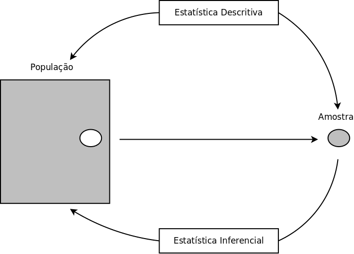
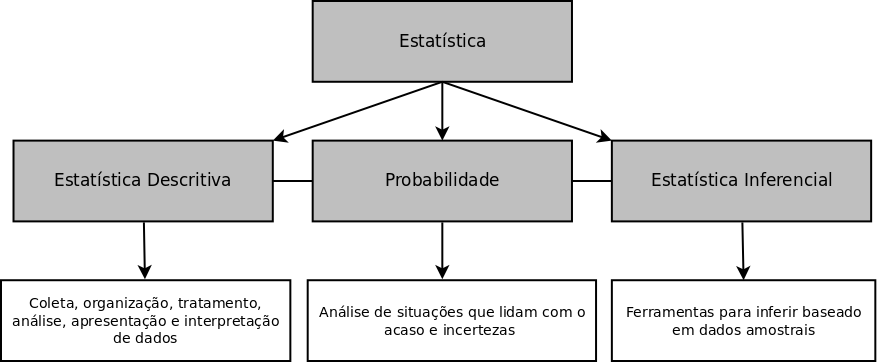

```{r setup, cache=FALSE, include=FALSE}
source("setup_knitr_slides.R")
library(xtable)
```

# Informações gerais

### Referência bibliográfica

Livro-texto:

- Marcos Nascimento Magalhães e Antonio Carlos Pedroso de Lima. **Noções
  de Probabilidade e Estatística**. Editora: EDUSP.

\begin{figure}
\includegraphics[height=0.5\textheight]{img/livro.png}
\end{figure}

### Tópicos do curso

1. Análise exploratória de dados.
2. Probabilidades.
3. Variáveis aleatórias discretas.
4. Medidas resumo.
5. Variáveis bidimensionais.
6. Variáveis aleatórias contínuas.
7. Inferência estatística - Estimação.
8. Inferência estatística - Testes de hipóteses.
9. Tópicos especiais.

## O que é estatística?

### O que é estatística?

- Estatística é um conjunto de técnicas para, sistematicamente:
    - planejar a coleta de dados oriundos de estudos ou experimentos,
      realizados em qualquer área do conhecimento.
    - descrever, analisar e interpretar dados
    - extrair informações para subsidiar decisões ou conclusões

### Tópicos de estatística básica

- Conceitos essenciais em Estatística:
    - Estatística descritiva.
    - Probabilidade.
    - Inferência estatística.
- Conceitos fundamentais:
    - **População**: Conjunto de todos os elementos sob investigação.
    - **Amostra**:  Subconjunto da população.
    - **Variável** de interesse: característica a ser observada em cada indivíduo da amostra

### População e amostra

```{r, out.width='70%'}

```

### Etapas da análise estatística

- Definição do método de coleta de dados
    - estabelecer os objetivos (questões) de pesquisa
    - definir critérios objetivos de como e quais dados coletar
    - postular a análise estatística a ser utilizada

\pause

- Estatística Descritiva
    - depende do tipo de dado coletado
    - deve ser racionalizada
    - relacionada com os objetivos da pesquisa

\pause

- Inferência estatística
    - depende do objetivo da pesquisa

### Planejamento da coleta de dados

- Definição do experimento
    - variáveis respostas
    - variáveis de controle
    - desenho do experimento e randomização

\pause

 - Coleta de dados por amostragem
    - definição da população e característica de interesse
    - definição do plano amostral
        - Aleatória simples (com ou sem reposição) ou sistemática
        - Estratificada, por estratos da população (segundo uma característica)
        - Conglomerados, por grupos de indivíduos da população (subpopulações)
        - Amostragem complexa (combina anteriores)

\pause

 - Coleta de dados observacionais. Exemplos:
    - população de plantas
    - presença de seres vivos num ambiente
    - fenômenos climáticos

### Análise estatística

  - Estatística Descritiva
    - consistência e interpretações iniciais
    - visualização dos dados e relações entre variáveis

  - Inferência estatística
    - estimação de quantidades desconhecidas
    - formulação e teste de hipóteses
    - extrapolar para a população, se os dados são de uma amostra.

### Etapas da análise estatística

```{r, out.width='90%'}

```

# Análise exploratória de dados

### Exemplo
Pesquisa foi realizada com alunos. Variáveis:

- **Id**: identificação do aluno;  **Turma**:  A ou B
- **Sexo**: feminino (F) ou masculino (M)
- **Idade**: em anos; **Alt**: altura em metros
- **Peso**: em quilogramas; **Filhos**: nº de filhos na família
- **Fuma**: hábito de fumar: sim (S) ou não (N)
- **Toler**: tolerância ao cigarro: (I) indiferente; (P) incomoda pouco; (M) incomoda muito
- **Exerc.**: horas de atividade física, por semana
- **Cine**: nº. de vezes que vai ao cinema por semana
- **OpCine**: opinião a respeito das salas de cinema na cidade: (B)
  regular a boa; (M) muito boa
- **TV**: horas gastas assistindo TV, por semana
- **OpTV**:  opinião  a  respeito  da  qualidade  da  programação  na
  TV: (R)  ruim;  (M)  média;  (B)  boa; (N) não sabe.

## Organização de Dados

### Organização de Dados

- A partir de um conjunto de dados coletado, a questão é:
    - Como extrair informações a respeito de uma ou mais características de interesse?
- Basicamente temos duas opções:
    - Tabelas de frequência
    - Gráficos
- O importante é levar em consideração a **natureza dos dados**.

### Organização de Dados

- Uma típica **tabela de dados brutos** contém:
    - Variáveis (características, medições, etc) nas colunas
    - Sujeito (indivíduo, objetos, etc) nas linhas

```{r, comment=NA}
# Carregando os dados
dados <- read.table("dados/questionario.txt", header = TRUE)
print(head(dados), row.names = FALSE)
```

- Tipos de variáveis:
    - Qualitativa nominal: Turma, Sexo, Fuma,
    - Qualitativa ordinal: Toler, OpCine, OpTV.
    - Quantitativa discreta: Idade, Filh, Exer, Cine, TV.
    - Quantitativa contínua: Alt, Peso.

### Tipos de variáveis

```{r, out.width='70%'}
knitr::include_graphics("img/classificacao_variaveis.png")
```

## Tabelas de frequência

### Tabelas de frequência

- A tabela de dados brutos pode ser muito longa, portanto será difícil
  extrair alguma informação
- As **tabelas de frequência** ajudam a resumir a informação da variável
  de interesse
- Vamos usar 3 tipos de frequência:
    - Frequência **absoluta**: contagem de cada valor observado.
    Representado por $n_i$ o número de valores $i$, e $n$ o número total
    - Frequência **relativa**: número de valores $i$ dividido pelo total
    $n$, ou seja $f_i = \frac{n_i}{n}$
    - Frequência **acumulada**: frequência (absoluta ou relativa)
    acumulada até um certo valor, obtida pela soma das frequências de
    todos os valores da variável, menores ou iguais ao valor considerado

### Tabela de frequência - qualitativa nominal

- Considerando a variável `Sexo`

```{r, results='asis'}
## Sexo
tab <- table(dados$Sexo)
dtab <- cbind(n_i = addmargins(tab),
              f_i = addmargins(prop.table(tab)))
print(xtable(dtab, digits = c(0, 0, 2)),
      comment = FALSE,
      hline.after = c(-1, 0, nrow(dtab)-1, nrow(dtab)),
      sanitize.colnames.function = function(x){
    paste0("$", x, "$")
})
```

- Não faz sentido usar frequência acumulada

### Tabela de frequência - quantitativa discreta

- Considerando a variável `Idade`

```{r, results='asis'}
## Idade
tab <- table(factor(dados$Idade, levels = 17:25))
dtab <- cbind(n_i = addmargins(tab),
              f_i = addmargins(prop.table(tab)),
              "f_{ac}" = c(cumsum(prop.table(tab)), NA))
print(xtable(dtab, digits = c(0, 0, 2, 2)),
      comment = FALSE,
      hline.after = c(-1, 0, nrow(dtab)-1, nrow(dtab)),
      sanitize.colnames.function = function(x){
    paste0("$", x, "$")
})
```

### Tabela de frequência - qualitativa ordinal

- Considerando a variável `OpTV`

```{r, results='asis'}
## OpTV
tab <- table(factor(dados$OpTV, levels = c("R", "M", "B", "N")))
dtab <- cbind(n_i = addmargins(tab),
              f_i = addmargins(prop.table(tab)),
              "f_{ac}" = c(cumsum(prop.table(tab)), NA))
print(xtable(dtab, digits = c(0, 0, 2, 2)),
      comment = FALSE,
      hline.after = c(-1, 0, nrow(dtab)-1, nrow(dtab)),
      sanitize.colnames.function = function(x){
    paste0("$", x, "$")
})
```

### Tabela de frequência - quantitativa contínua

- No caso de quantitativas contínuas não faz sentido contar cada valor
  pois podem existir muitos
- A solução é criar **classes** ou **faixas de valores**, e contar o
  número de ocorrências dentro destas classes.
- Para definir as classes:
  1. Defina a amplitude da classe, de maneira que se obtenham de 5 a 8
     classes (de mesma amplitude)
  2. Identifique os valores máximo e mínimo da variável e construa as
     classes de maneira que inclua todos os valores

As classes de valores podem seguir um dos formatos:

\small

Classe  Notação        Denominação                 Resultado
------- -------------- --------------------------- ------------------------
$[a,b)$   $a \vdash b$  Fechado em a, aberto em b  Inclui a, não inclui b
$(a,b]$   $a \dashv b$  Aberto em a, fechado em b  Não inclui a, inclui b

### Tabela de frequência - quantitativa contínua

- Considerando a variável `Peso`
    - Foram construídas 6 classes de amplitude 10
    - As classes são do tipo $[a,b)$ ou $a \vdash b$

```{r, results='asis'}
## Peso
tab <- table(cut(dados$Peso, breaks = seq(40, 100, 10), right = FALSE))
dtab <- cbind(n_i = addmargins(tab),
              f_i = addmargins(prop.table(tab)),
              "f_{ac}" = c(cumsum(prop.table(tab)), NA))
print(xtable(dtab, digits = c(0, 0, 2, 2)),
      comment = FALSE,
      hline.after = c(-1, 0, nrow(dtab)-1, nrow(dtab)),
      sanitize.colnames.function = function(x){paste0("$", x, "$")},
      sanitize.rownames.function = function(x){paste0("$", x, "$")}
      )
```

### Tabela de frequência - quantitativa discreta (muitos valores)

- Considerando a variável `TV`
- Apesar de ser discreta, a amplitude de valores é muito grande e não
  seria viável contar as frequências de cada valor
- Nesse caso, utiliza-se o mesmo procedimento para quantitativas contínuas
    - Foram construídas 6 classes de amplitude 6^[**Obs.**: no livro a
    tabela tem 5 classes, pois a última tem comprimento 12.]
    - As classes são do tipo $[a,b)$ ou $a \vdash b$

```{r, results='asis'}
## TV
tab <- table(cut(dados$TV, breaks = seq(0, 36, 6), right = FALSE))
dtab <- cbind(n_i = addmargins(tab),
              f_i = addmargins(prop.table(tab)),
              "f_{ac}" = c(cumsum(prop.table(tab)), NA))
print(xtable(dtab, digits = c(0, 0, 2, 2)),
      comment = FALSE,
      hline.after = c(-1, 0, nrow(dtab)-1, nrow(dtab)),
      sanitize.colnames.function = function(x){paste0("$", x, "$")},
      sanitize.rownames.function = function(x){paste0("$", x, "$")}
      )
```

## Representação gráfica

### Representação gráfica

- As informações contidas nas tabelas podem ser visualizadas através de
  gráficos
- Assim como nas tabelas, existe um tipo de gráfico adequado para cada
  tipo de variável
- Cuidado deve ser tomado com representações visuais pois um gráfico
  desproporcional pode gerar interpretações distorcidas
- Os principais são:
    - Diagrama circular  (setores ou "pizza")
    - Gráfico de barras
    - Histograma
    - Boxplot

### Diagrama circular

- Adequado para variáveis qualitativas nominal e ordinal.

```{r}
par(mfrow = c(1, 2))
pie(table(dados$Sexo), main = "Sexo")
pie(table(dados$Toler), main = "Toler")
par(mfrow = c(1, 1))
```

-  O uso deste tipo de gráfico deve ser evitado, pois pode ser de
   difícil interpretação

### Gráfico de barras

- Adequado para variáveis qualitativas nominal/ordinal e quantitativa
  discreta.
- Podem ser usadas as frequências absolutas ou relativas

```{r, fig.width=6, fig.height=4}
par(mfrow = c(1,4), mar=c(2.6, 2.8, 1.2, 0.5), mgp = c(1.6, 0.6, 0))
barplot(table(dados$Idade), main = "Idade", ylab = "Frequência")
barplot(prop.table(table(dados$Idade)), main = "Idade",
        ylab = "Frequência relativa")
barplot(table(dados$Filh), main = "Filhos", ylab = "Frequência")
barplot(prop.table(table(dados$Filh)), main = "Filhos",
        ylab = "Frequência relativa")
```

### Histograma

- Adequado para quantitativa contínua.

```{r eval = TRUE, fig= TRUE, width=8, height=4}
par(mfrow = c(1,2), mar=c(2.6, 2.8, 1.2, 0.5), mgp = c(1.6, 0.6, 0))
hist(dados$Peso, prob = TRUE, ylab = "Densidade", xlab = "Peso",
     ylim = c(0, 0.05),
     breaks = c(39.9, 49.9, 59.9, 69.9, 79.9, 89.9, 99.9), main = "")
hist(dados$Alt, prob = TRUE, ylab = "Densidade", xlab = "Altura",
     main = "")
```

- Altura de cada retângulo é a densidade definida pelo quociente
da área pela amplitude da faixa, $h = \frac{f_i}{AMP}$.

### Mediana e quartis

- **Mediana**: valor da variável que divide o conjunto de dados
ordenados em dois subgrupos de mesmo tamanho.
- **Quartis**: valores da variável que divide o conjunto de dados
ordenados em quatro subgrupos de mesmo tamanho.
- **Posição** dos quartis:
    - $Q_1 = 0.25 \cdot (N+1)$ e arredonde.
    - $Q_2 =$ média dos valores nas posições $(N/2)$ e $(N/2)+1$ se N par
    e $Q_2 = (N+1)/2$ se N ímpar.
    - $Q_3 = 0.75 \cdot (N+1)$  e arredonde.
- Exemplo: Conside o conjunto de dados: $8.43(1)$, $8.65(2)$, $9.96(3)$,
  $10.91(4)$,  $10.46(5)$ e $10.83(6)$.
    - $Q_1 = 0.25 \cdot 7 = 1.75 \approx 2$, ou seja $8.65$.
    - $Q_2 =$ média dos valores nas posições $3$ e $4$, ou seja, $(9.96 +
    10.91 )/2 = 10.43$.
    - $Q_3 = 0.75 \cdot 7 = 5.25 \approx 5$, ou seja, $10.46$.

### Boxplots

- Adequado para quantitativa contínua.

```{r}
par(mfrow = c(2,2), mar=c(2.6, 2.8, 1.2, 0.5), mgp = c(1.6, 0.6, 0))
boxplot(dados$Peso ~ dados$Sexo, ylab = "Peso", xlab = "Sexo")
boxplot(dados$Alt ~ dados$Sexo, ylab = "Altura", xlab = "Sexo")
boxplot(dados$Peso ~ dados$Fum, ylab = "Peso", xlab = "Fumante")
boxplot(dados$Alt ~ dados$Fum, ylab = "Altura", xlab = "Fumante")
```

- Excelente para explorar relações entre variáveis quantitativas
e qualitativas.

### Tipos de simetria

```{r, out.width='80%'}
## Gera dados
set.seed(12)
x <- rnorm(1000)
xdir <- rexp(1000)
xesq <- -xdir
## Layout
layout(mat = matrix(1:6, nrow = 2, ncol = 3),  height = c(1,8))
## Esquerda
par(mar = c(0, 1.1, 1.1, 1.1))
boxplot(xesq, horizontal = TRUE, axes = FALSE,
        main = "Assimétrico à esquerda")
par(mar = c(1.1, 1.1, 1.1, 1.1))
hist(xesq, main = "", axes = FALSE)
## Simétrico
par(mar = c(0, 1.1, 1.1, 1.1))
boxplot(x, horizontal = TRUE, axes = FALSE, main = "Simétrico")
par(mar = c(1.1, 1.1, 1.1, 1.1))
hist(x, main = "", axes = FALSE)
## Direita
par(mar = c(0, 1.1, 1.1, 1.1))
boxplot(xdir, horizontal = TRUE, axes = FALSE,
        main = "Assimétrico à direita")
par(mar = c(1.1, 1.1, 1.1, 1.1))
hist(xdir, main = "", axes = FALSE)
```

### Diagrama de dispersão

- Adequado para verificar relação entre variáveis quantitativas.

```{r}
par(mfrow = c(1,1), mar=c(2.6, 2.8, 1.2, 0.5), mgp = c(1.6, 0.6, 0))
plot(dados$Peso ~ dados$Alt, ylab = "Peso", xlab = "Altura")
```

### Gráfico de mosaico

- Adequado para verificar relação entre variáveis qualitativas (nominais
  ou ordinais).

```{r}
par(mfrow = c(1,1), mar=c(2.6, 2.8, 1.2, 0.5), mgp = c(1.6, 0.6, 0))
mosaicplot(table(dados$Sexo, dados$Fuma), main = "",
           xlab = "Sexo", ylab = "Fuma")
```

```{r, include=FALSE, eval=FALSE}
## QQ plot - tem somente na ultima edição do livro
qF <- quantile(dados$Peso[dados$Sexo == "F"], probs = seq(.1,.9,.1))
qM <- quantile(dados$Peso[dados$Sexo == "M"], probs = seq(.1,.9,.1))
plot(qF, qM, xlim = c(40, 90), ylim = c(40, 90),
     xlab = "Mulheres", ylab = "Homens")
abline(a = 0, b = 1, lty = 2)
```

# Exercícios recomendados

### Exercícios recomendados

- Seção 1.1: Ex. 1, 2 e 3.
- Seção 1.2: Ex. 1 e 4.
- Seção 1.4: Ex. 1, 3, 5 (troque diagrama circular pro gráfico de
  barras), 8, 9, 12, 18 e 20.
