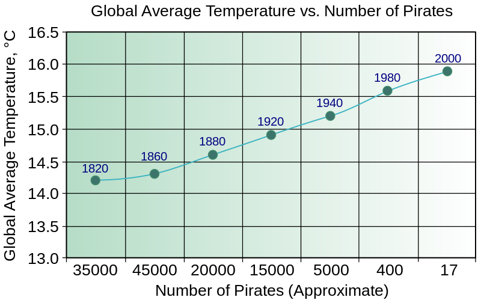

```{r setup, cache=FALSE, include=FALSE}
source("setup_knitr_slides.R")
op <- par(no.readonly = TRUE)
library(xtable)
## O pacote printr já configura o formato de saída de muitas funções
## como head(), table(), etc, sem a necessidade de usar a função
## knitr::kable(). Veja: https://yihui.name/printr
loadNamespace("printr")
## Para desabilitar, use
## unloadNamespace("printr")
```

# Introdução

### Introdução

Um problema comum é o estudo da relação entre duas variáveis, $X$ e
$Y$.

Na prática, procura-se uma **função** de $X$ que explique $Y$, ou
seja,
$$
X,Y \rightarrow Y \simeq f(X)
$$

Essa relação, em geral, não é perfeita, ou seja, existem
**erros** associados.

### Introdução

Uma das preocupações estatísticas ao analisar dados é a de criar
**modelos** do fenômeno em observação.

As observações frequentemente estão misturadas com variações
**acidentais** ou **aleatórias**.

Assim, é conveniente supor que cada observação é formada por duas
partes: uma **previsível** (ou controlada) e outra
**aleatória** (ou não previsível), ou seja
$$
\text{(observação)} = \text{(previsível)} + \text{(aleatório)}
$$

### Introdução

$$
\text{(observação)} = \text{(previsível)} + \text{(aleatório)}
$$

A parte previsível, incorpora o conhecimento sobre o fenômeno, e é
usualmente expressa por uma **função matemática** com
**parâmetros desconhecidos**.

A parte aleatória deve obedecer algum **modelo de probabilidade**

Com isso, o trabalho é produzir **estimativas** para os
parâmetros desconhecidos, com base em amostras observadas.

### Introdução

$$
\text{(observação)} = \text{(previsível)} + \text{(aleatório)}
$$

Matematicamente, podemos escrever
$$
y_i = \theta + e_i
$$
onde

- $y_i$ = observação $i$
- $\theta$ = efeito fixo, comum a todos os indivíduos
- $e_i$ = "erro" da observação $i$, ou efeito residual ou
aleatório

$e_i$ pode ser considerado como o efeito resultante de várias
características que não estão explícitas no modelo.

### Introdução

**Exemplo:** considerando que o peso médio da população é de $\mu =
62$ kg, então o peso de cada pessoa $y_i$ pode ser descrita pelo
seguinte modelo
$$
y_i = 62 + e_i
$$
onde $\theta = \mu$, e cada $e_i$ determinará o peso de cada pessoa, em
função de diversos fatores como: altura, sexo, idade, país, ..., ou
seja
$$
e_i = f(\text{altura}, \text{sexo}, \text{idade}, \text{país}, \ldots)
$$
Ou seja, à medida que **relacionamos** o peso com outras
variáveis, ganhamos informação e diminuimos o **erro**.

### Introdução

Por exemplo, podemos relacionar os pesos de 5 pessoas com suas
respectivas alturas.

```{r, fig.width=6, fig.height=5}
alt <- c(165, 168, 170, 175, 178)
peso <- c(55, 57, 65, 68, 71)
plot(peso ~ alt, xlab = "Altura (cm)", ylab = "Peso (kg)", pch = 19)
```

E notamos que existe uma aparente **relação linear** entre estas
variáveis.

### Introdução

Por exemplo, podemos relacionar os pesos de 5 pessoas com suas
respectivas alturas.

```{r, fig.width=6, fig.height=5}
plot(peso ~ alt, xlab = "Altura (cm)", ylab = "Peso (kg)", pch = 19)
abline(h = 62, col = 2, lwd = 2)
text(x = 164, y = 62, labels = expression(mu == 62),
     xpd = TRUE, pos = 2, offset = -0.5)
```

E notamos que existe uma aparente **relação linear** entre estas
variáveis.

### Introdução

Como o peso depende da altura de maneira linear, podemos então aprimorar
o modelo anterior incorporando essa informação.

```{r fig.width=6, fig.height=5}
plot(peso ~ alt, xlab = "Altura (cm)", ylab = "Peso (kg)", pch = 19)
abline(h = 62, col = 2, lwd = 2)
text(x = 164, y = 62, labels = expression(mu == 62),
     xpd = TRUE, pos = 2, offset = -0.5)
m0 <- lm(peso ~ alt)
abline(m0, lty = 2, lwd = 2, col = 2)
```

### Introdução

Um **modelo linear** entre duas variáveis $X$ e $Y$, é definido
matematicamente como uma equação com dois parâmetros desconhecidos,
$$
Y = \beta_0 + \beta_1 X
$$
Sendo assim, o modelo anterior onde conheciamos só a média $\mu$,
$$
y_i = \mu + e_i
$$
pode ser reescrito como
$$
y_i = \beta_0 + \beta_1\, \text{altura} + e_i
$$
Note que o erro deve diminuir, pois agora
$$
e_i = f(\text{\sout{altura}}, \text{sexo}, \text{idade}, \text{país}, \ldots)
$$
ou seja, incorporamos uma informação para explicar o peso, que antes
estava inserida no erro.

### Introdução

No exemplo anterior, notamos que o peso é uma variável
**dependente** (linearmente) da altura.

A **análise de regressão** é a técnica estatística que analisa as
relações existentes entre uma única variável **dependente**, e
uma ou mais variáveis **independentes**.

O objetivo é estudar as relações entre as variáveis, a partir de um
**modelo matemático**, permitindo **estimar** o valor de uma
variável a partir da outra.

- Exemplo: sabendo a altura podemos determinar o peso de uma
pessoa, se conhecemos os parâmetros do modelo anterior

### Introdução

O problema da análise de regressão consiste em definir a
**forma** de relação existente entre as variáveis.

Por exemplo, podemos ter as seguintes relações
\begin{align*}
Y &= \beta_0 + \beta_1 X &\qquad \text{linear} \\
Y &= \beta_0 X^{\beta_1} &\qquad \text{potência} \\
Y &= \beta_0 e^{\beta_1 X} &\qquad \text{exponencial} \\
Y &= \beta_0 + \beta_1 X + \beta_2 X^2 &\qquad \text{polinomial} \\
\end{align*}
Em todos os casos, a variável **dependente** é $Y$, aquela que
será **predita** a partir da relação e da variável **independente** $X$

# Regressão linear

### Regressão linear

Em uma **análise de regressão linear** consideraremos apenas as
variáveis que possuem uma **relação linear** entre si.

Uma análise de regressão linear **múltipla** pode associar $k$
variáveis independentes ($X$) para "explicar" uma única variável
dependente ($Y$),
$$
Y = \beta_0 + \beta_1 X_1 + \beta_2 X_2 + \cdots + \beta_k X_k + e
$$

Uma análise de regressão linear **simples** associa uma única
variável independente ($X$) com uma variável dependente ($Y$),
$$
Y = \beta_0 + \beta_1 X + e
$$

### Regressão linear

Assim, dados $n$ pares de valores, $(X_1, Y_1), (X_2, Y_2), \ldots,
(X_n, Y_n)$, se for admitido que $Y$ é função linear de $X$, pode-se
estabelecer uma regressão linear simples, cujo modelo estatístico é
$$
Y_i = \beta_0 + \beta_1 X_i + e_i, \quad i = 1, 2, ..., n
$$
onde:

- $Y$ é a variável **resposta** (ou **dependente**)
- $X$ é a variável **explicativa** (ou **independente**)
- $\beta_0$ é o **intercepto** da reta (valor de $Y$ quando
$X = 0$)
- $\beta_1$ é o **coeficiente angular** da reta
(**efeito** de $X$ sobre $Y$)
- $e \sim \text{N}(0, \sigma^2)$ é o **erro**, ou
**desvio**, ou **resíduo**

O problema agora consiste em **estimar** os parâmetros $\beta_0$
e $\beta_1$.

### Interpretação dos parâmetros

$\beta_0$ representa o ponto onde a reta corta o eixo $Y$ (na maioria
das vezes não possui interpretação prática)

$\beta_1$ representa a variabilidade em $Y$ causada pelo aumento de
uma unidade em $X$. Além disso,

- $\beta_1 > 0$ mostra que com o aumento de $X$, também há um
aumento em $Y$
- $\beta_1 = 0$ mostra que **não há efeito** de $X$ sobre $Y$
- $\beta_1 < 0$ mostra que com a aumento de $X$, há uma diminuição
em $Y$

### Interpretação dos parâmetros

```{r, fig.width=6, fig.height=5, out.width='80%'}
plot(peso ~ alt, xlab = "Altura (cm)", ylab = "Peso (kg)", pch = 19)
abline(m0)
beta0 <- round(coef(m0)[1], 2)
beta1 <- round(coef(m0)[2], 2)
text(x = 175, y = 60,
     labels = bquote(hat(Y) == .(beta0) + .(beta1) * X))
```

### Estimação dos parâmetros

Como através de uma amostra obtemos uma estimativa da verdadeira
equação de regressão, denominamos
$$
\hat{Y}_i = \hat{\beta}_0 + \hat{\beta}_1 X_i
$$
ou seja, $\hat{Y}_i$ é o valor **estimado** de $Y_i$, através
das **estimativas** de $\beta_0$ e $\beta_1$, que chamaremos de
$\hat{\beta}_0$ e $\hat{\beta}_1$.

Para cada valor de $Y_i$, temos um valor $\hat{Y}_i$ estimado pela
equação de regressão,
$$
Y_i = \hat{Y}_i + e_i
$$

### Estimação dos parâmetros

Portanto, o erro (ou desvio) de cada observação em relação ao modelo
adotado será
\begin{align*}
e_i &= Y_i - \hat{Y}_i \\
e_i &= Y_i - (\beta_0 + \beta_1 X_i)
\end{align*}

Devemos então adotar um modelo cujos parâmetros $\beta_0$ e
$\beta_1$, tornem esse diferença a menor possível.

Isso equivale a **minimizar** a **soma de quadrados dos
resíduos** ($SQR$), ou do erro,
$$
SQR = \sum_{i=1}^{n} [Y_i - (\beta_0 + \beta_1 X_i)]^2
$$

### Estimação dos parâmetros

O método de minimizar a soma de quadrados dos resíduos é denominado de
**método dos mínimos quadrados**.

Para se encontrar o ponto mínimo de uma função, temos que obter as
derivadas parciais em relação a cada parâmetro,
\begin{align*}
\frac{\partial SQR}{\partial \beta_0} &= 2 \sum_{i=1}^{n} [Y_i -
\beta_0 - \beta_1 X_i] (-1) \\
\frac{\partial SQR}{\partial \beta_1} &= 2 \sum_{i=1}^{n} [Y_i -
\beta_0 - \beta_1 X_i] (-X_i)
\end{align*}
e igualar os resultados a zero
$$
\hat{\beta}_0 = \frac{\partial SQR}{\partial \beta_0} = 0 \qquad
\text{e} \qquad
\hat{\beta}_1 = \frac{\partial SQR}{\partial \beta_1} = 0
$$

### Estimação dos parâmetros

Dessa forma, chegamos às **estimativas de mínimos quadrados**
para os parâmetros $\beta_0$ e $\beta_1$:
\begin{align*}
\hat{\beta}_1 &= \frac{\sum_{i=1}^{n} x_i y_i - n \bar{x} \bar{y}}
 {\sum_{i=1}^{n} x_i^2 - n \bar{x}^2} \\
& \\
\hat{\beta_0} &= \bar{y} - \hat{\beta}_1 \bar{x}
\end{align*}
onde
\begin{align*}
\bar{y} = \frac{1}{n} \sum_{i=1}^{n} y_i \qquad \text{e} \qquad
\bar{x} = \frac{1}{n} \sum_{i=1}^{n} x_i
\end{align*}

### Exemplo

A tabela a seguir relaciona as distâncias percorridas por carros (km)
e seus consumos de combustível (litros), em uma amostra de 10 carros
novos.

```{r}
dist <- c(20,60,15,45,35,80,70,73,28,85)
cons <- c(1.33, 5.45, 1.66, 3.46, 2.92, 6.15, 4.11, 5.00, 2.95, 6.54)
rbind(Distância = dist, Consumo = cons)
```

Com isso:

a. Faça um diagrama de dispersão
b. Traçe um modelo linear aproximado
c. Estime os parâmetros $\hat{\beta}_0$ e $\hat{\beta}_1$
d. Interprete o resultado. Pode-se concluir que para percursos mais
longos há maior consumo de combustível?
d. Faça uma *predição* do consumo de combustível para uma
distância de 50 km.

```{r, include=FALSE}
## Gráfico -------------------------------------------------------------
plot(cons ~ dist, xlab = "Distância (km)", ylab = "Consumo (l)", pch = 19,
     xlim = c(0,90), ylim = c(0, 8))
m1 <- lm(cons ~ dist)
abline(m1)

## Estimativa dos parâmetros -------------------------------------------
x <- dist
y <- cons
n <- length(x)
## Somatórios
(xy <- sum(x*y))
(xbar <- mean(x))
(ybar <- mean(y))
(x2 <- sum(x^2))
## Resultado
b1 <- (xy - n*xbar*ybar)/(x2 - n*xbar^2)
b0 <- ybar - b1*xbar
## Conferindo
coef(m1)

## Predição ------------------------------------------------------------
b0 + b1*50
```

### Exemplo

```{r, fig.width=6, fig.height=5, out.width='80%'}
plot(cons ~ dist, xlab = "Distância (km)", ylab = "Consumo (l)", pch = 19,
     xlim = c(0,90), ylim = c(0, 8))
m1 <- lm(cons ~ dist)
abline(m1)
beta0 <- round(coef(m1)[1], 3)
beta1 <- round(coef(m1)[2], 3)
text(x = 70, y = 2,
     labels = bquote(hat(Y) == .(beta0) + .(beta1) * X),
     cex = 1.2)
```

### Exemplo

A tabela a seguir relaciona os pesos de carros (t) e o rendimento de
combustível (em km/l), para uma amostra de 10 carros.

```{r}
peso <- c(1.32, 1.59, 1.27, 1.99, 1.13, 1.54, 1.36, 1.5, 1.27, 1.09)
rend <- c(13.18, 11.45, 12.33, 10.63, 13.18, 12.33, 11.90, 11.90, 11.90,
          14.00)
rbind(Peso = peso, Rendimento = rend)
```

Com isso:

a. Faça um diagrama de dispersão
b. Traçe um modelo linear aproximado
c. Estime os parâmetros $\hat{\beta}_0$ e $\hat{\beta}_1$
d. Interprete o resultado. O que você pode concluir a respeito do
rendimento?
e. Faça uma *predição* do rendimento de combustível para um
veículo com peso de 1.8 t.

```{r, include=FALSE}
## Gráfico -------------------------------------------------------------
plot(rend ~ peso, xlab = "Peso (t)", ylab = "Rendimento (km/l)", pch = 19,
     xlim = c(1,2), ylim = c(10, 15))
m2 <- lm(rend ~ peso)
abline(m2)

## Estimativa dos parâmetros -------------------------------------------
x <- peso
y <- rend
n <- length(x)
## Somatórios
(xy <- sum(x*y))
(xbar <- mean(x))
(ybar <- mean(y))
(x2 <- sum(x^2))
## Resultado
b1 <- (xy - n*xbar*ybar)/(x2 - n*xbar^2)
b0 <- ybar - b1*xbar
## Conferindo
coef(m2)

## Predição ------------------------------------------------------------
b0 + b1*1.8
```

### Exemplo

```{r, fig.width=6, fig.height=5, out.width='80%'}
plot(rend ~ peso, xlab = "Peso (t)", ylab = "Rendimento (km/l)", pch = 19,
     xlim = c(1,2), ylim = c(10, 15))
m2 <- lm(rend ~ peso)
abline(m2)
beta02 <- round(coef(m2)[1], 3)
beta12 <- abs(round(coef(m2)[2], 3))
text(x = 1.8, y = 14,
     labels = bquote(hat(Y) == .(beta02) - .(beta12) * X),
     cex = 1.2)
```

# Correlação

### Correlação

Até agora o interesse estava em estudar qual a influência de uma
V.A. $X$ sobre uma V.A. $Y$, por meio de uma **relação linear**.

Assim, em uma análise de regressão é indispensável identificar qual
variável é dependente.

Na **análise de correlação** isto não é necessário, pois queremos
estudar o **grau de relacionamento** entre as variáveis $X$ e
$Y$, ou seja, uma medida de **covariabilidade** entre elas.

A correlação é considerada como uma medida de **influência mútua** entre
variáveis, por isso não é necessário especificar quem influencia e quem
é influenciado.

### Correlação

O **grau de relação** entre duas variáveis pode ser medido
através do **coeficiente de correlação linear** ($r$), dado por
$$
r = \frac{\sum_{i=1}^n x_i y_i - n\bar{x}\bar{y}}{\sqrt{[\sum_{j=1}^n x_j^2 - n \bar{x}^2] [\sum_{j=1}^n y_j^2 - n \bar{y}^2]}}
= \frac{\text{Cov}(XY)}{\text{DP}(X) \cdot \text{DP}(Y)}
$$
onde
$$
-1 \leq r \leq 1
$$
Portanto,

- $r=1$ correlação **positiva** perfeita entre as variáveis
- $r=0$ **não há** correlação entre as variáveis
- $r= -1$ correlação **negativa** perfeita entre as variáveis

### Correlação

Existem muitos tipos de associações possíveis, e o coeficiente de
correlação avalia o quanto uma nuvem de pontos no gráfico de dispersão
se aproxima de uma reta.

```{r, out.width='30%', fig.show="hold", fig.width=5, fig.height=5}
plot(1:10, 1:10, type = "l", xlab = "", ylab = "",  main = "r = 1")
plot(1:10, rep(5,10), type = "l", xlab = "", ylab = "", main = "r = 0")
plot(1:10, -1:-10, type = "l", xlab = "", ylab = "", main = "r = -1")
```

### Coeficiente de determinação

O **coeficiente de determinação** ($r^2$) é o quadrado do
coeficiente de correlação, por consequência
$$
0 \leq r^2 \leq 1
$$
O $r^2$ nos dá a **porcentagem de variação em $Y$ que pode ser explicada
pela variável independente $X$**.

Quanto mais próximo de 1, maior é a explicação da variável $Y$ pela
variável $X$.

### Correlação
```{r, out.width='80%', fig.width=8,fig.height=6}
x <- (1:100)/10
n <- length(x)
set.seed(1000)
par(mfrow=c(2,2), mar = c(4, 4, 4, 2))
e <- rnorm(n, 0, 2)
y <- 20 + x + e
cor <- round(cor(x,y), 2)
r <- round(cor^2, 2)
lis <- list(bquote(r == .(cor)),
            bquote(r^2 == .(r)))
plot(y ~ x, xlim = c(0, 10), ylim = c(0, 45))
mtext(do.call(expression, lis), side = 3, line = 0:1)
mm <- lm(y ~ x)
abline(mm, lwd = 2)
e <- rnorm(n, 0, 4)
y <- 20 + x + e
cor <- round(cor(x,y), 2)
r <- round(cor^2, 2)
lis <- list(bquote(r == .(cor)),
            bquote(r^2 == .(r)))
plot(y ~ x, xlim = c(0, 10), ylim = c(0, 45))
mtext(do.call(expression, lis), side = 3, line = 0:1)
mm <- lm(y ~ x)
abline(mm, lwd = 2)
e <- rnorm(n, 0, 6)
y <- 20 + x + e
cor <- round(cor(x,y), 2)
r <- round(cor^2, 2)
lis <- list(bquote(r == .(cor)),
            bquote(r^2 == .(r)))
plot(y ~ x, xlim = c(0, 10), ylim = c(0, 45))
mtext(do.call(expression, lis), side = 3, line = 0:1)
mm <- lm(y ~ x)
abline(mm, lwd = 2)
e <- rnorm(n, 0, 8)
y <- 20 + x + e
cor <- round(cor(x,y), 2)
r <- round(cor^2, 2)
lis <- list(bquote(r == .(cor)),
            bquote(r^2 == .(r)))
plot(y ~ x, xlim = c(0, 10), ylim = c(0, 45))
mtext(do.call(expression, lis), side = 3, line = 0:1)
mm <- lm(y ~ x)
abline(mm, lwd = 2)
par(op)
```

### Exemplo

Usando os dados do primeiro exemplo anterior, calcule o coeficiente de
correlação e o $r^2$.

```{r}
rbind(Distância = dist, Consumo = cons)
```

$\sum_{i=1}^{n} X_i = `r sum(dist)`$ \quad
$\sum_{i=1}^{n} Y_i = `r sum(cons)`$ \quad
$\sum_{i=1}^{n} X_iY_i = `r sum(cons*dist)`$

$\sum_{i=1}^{n} X_i^2 = `r format(sum(dist^2),sci=1)`$ \quad
$\sum_{i=1}^{n} Y_i^2 = `r sum(cons^2)`$

```{r, include=FALSE}
x <- dist
y <- cons
n <- length(x)
## Somatórios
(xy <- sum(x*y))
(xbar <- mean(x))
(ybar <- mean(y))
(x2 <- sum(x^2))
(y2 <- sum(y^2))
## Correlação
r <- (xy - n*xbar*ybar)/(sqrt((x2 - n*xbar^2)*(y2 - n*ybar^2)))
r; r^2
cor(x, y)
```

### Exemplo

```{r, fig.width=6, fig.height=5, out.width='80%'}
plot(cons ~ dist, xlab = "Distância (km)", ylab = "Consumo (l)", pch = 19,
     xlim = c(0,90), ylim = c(0, 8))
m1 <- lm(cons ~ dist)
abline(m1)
cor1 <- cor(cons, dist)
text(x = 70, y = 2,
     labels = bquote(hat(Y) == .(beta0) + .(beta1) * X),
     cex = 1.2)
text(x = 20, y = 6,
     labels = bquote(r == .(round(cor1, 2))), cex = 1.2)
text(x = 20, y = 5,
     labels = bquote(r^2 == .(round(cor1^2, 2))), cex = 1.2)
```

### Exemplo

Usando os dados do segundo exemplo anterior, calcule o coeficiente de
correlação e o $r^2$.

```{r}
rbind(Peso = peso, Rendimento = rend)
```

$\sum_{i=1}^{n} X_i = `r sum(peso)`$ \quad
$\sum_{i=1}^{n} Y_i = `r sum(rend)`$ \quad
$\sum_{i=1}^{n} X_iY_i = `r sum(rend*peso)`$

$\sum_{i=1}^{n} X_i^2 = `r sum(peso^2)`$ \quad
$\sum_{i=1}^{n} Y_i^2 = `r sum(rend^2)`$

```{r, include=FALSE}
x <- peso
y <- rend
n <- length(x)
## Somatórios
(xy <- sum(x*y))
(xbar <- mean(x))
(ybar <- mean(y))
(x2 <- sum(x^2))
(y2 <- sum(y^2))
## Correlação
r <- (xy - n*xbar*ybar)/(sqrt((x2 - n*xbar^2)*(y2 - n*ybar^2)))
r; r^2
cor(x, y)
```

### Exemplo

```{r, fig.width=6, fig.height=5, out.width='80%'}
plot(rend ~ peso, xlab = "Peso (t)", ylab = "Rendimento (km/l)", pch = 19,
     xlim = c(1,2), ylim = c(10, 15))
m2 <- lm(rend ~ peso)
abline(m2)
cor2 <- cor(rend, peso)
text(x = 1.8, y = 14,
     labels = bquote(hat(Y) == .(beta02) - .(beta12) * X),
     cex = 1.2)
text(x = 1.1, y = 11,
     labels = bquote(r == .(round(cor2, 2))), cex = 1.2)
text(x = 1.1, y = 10.5,
     labels = bquote(r^2 == .(round(cor2^2, 2))), cex = 1.2)
```

### Teste para o coeficiente de correlação

Usualmente definimos o coeficiente de correlação para uma amostra,
pois desconhecemos esse valor para a população.

Uma população que tenha duas variáveis não correlacionadas pode
produzir uma amostra com coeficiente de correlação diferente de zero.

Para **testar** se uma amostra foi colhida de uma população para
o qual o coeficiente de correlação entre duas variáveis é nulo,
precisamos obter a **distribuição amostral** da estatística $r$.

### Teste para o coeficiente de correlação

Seja $\rho$ o verdadeiro coeficiente de correlação populacional
desconhecido.

Para testar se o coeficiente de correlção populacional é igual a zero,
realizamos um teste de hipótese com
\begin{align*}
H_0 : \rho = 0 \\
H_a : \rho \neq 0
\end{align*}

A estatística de teste utilizada é
$$
t_{calc} = r \sqrt{\frac{n-2}{1-r^2}}
$$
que tem distribuição $t$ de Student com $n-2$ graus de liberdade.

### Teste para o coeficiente de correlação

**Procedimentos gerais**

- Usar as hipótestes:
$$
H_0 : \rho = 0 \quad \text{vs} \quad H_a : \rho \neq 0
$$
- Definir um nível de **significância** $\alpha$ (ex.: $\alpha =
0,05$)
- Determinar a **região de rejeição** com base no nível de
significância $\rightarrow$ $t_{crit}$ (com $n-2$ graus de liberdade)
- Calcular a **estatística de teste**, sob a hipótese nula
$$
t_{calc} = r \sqrt{\frac{n-2}{1-r^2}}
$$
- Rejeitar a hipótese nula se a estatística de teste calculada
estiver dentro da região de rejeição ou $|t_{calc}| > |t_{crit}|$

### Exemplo

Usando os dados dos exemplos anteriores, realize os testes de hipótese
para o coeficiente de correlação $\rho$, usando um nível de 5\% de
significância.

- Distância (km) x Consumo (l) $\rightarrow$ $r = `r round(cor1, 2)`$
- Peso (t) x Rendimento (km/l) $\rightarrow$ $r = `r round(cor2, 2)`$

```{r, include=FALSE}
## Primeiro exemplo ----------------------------------------------------
r <- cor(dist, cons)
n <- length(dist)
tcalc <- r * sqrt((n - 2)/(1 - r^2))
tcrit <- qt(0.05/2, df = n - 2)
abs(tcalc) > abs(tcrit)
## p-valor
2 * pt(tcalc, df = n - 2, lower.tail = FALSE)
cor.test(dist, cons)

## Segundo exemplo -----------------------------------------------------
r <- cor(peso, rend)
n <- length(peso)
tcalc <- r * sqrt((n - 2)/(1 - r^2))
tcrit <- qt(0.05/2, df = n - 2)
abs(tcalc) > abs(tcrit)
## p-valor
2 * pt(tcalc, df = n - 2)
cor.test(peso, rend)
```

### Exemplo

```{r}
tc <- round(qt(0.975, df = n - 2), 3)
r <- round(cor(dist, cons), 2)
n <- length(dist)
tcalc <- round(r * sqrt((n - 2)/(1 - r^2)), 3)
```

**Para o primeiro exemplo - Distância (km) x Consumo (l)**

Hipóteses: $H_0: \rho = 0$ vs $H_a: \rho \neq 0$

$\alpha = 0.05 \Rightarrow t_{crit} = `r tc` \Rightarrow RC = \{t \in
\mathbb{R} : t < `r -tc` \text{ ou } t > `r tc`\}$

$$
t_{calc} = r \sqrt{\frac{n-2}{1-r^2}} = `r r` \sqrt{\frac{`r n`-2}{1-`r r`^2}} = `r tcalc`
$$

Como $|t_{calc}| = `r tcalc` > `r tc` = |t_{crit}| \Rightarrow
\text{ Rejeita } H_0$


### Correlação

#### ATENÇÃO! --- Correlação não implica causação!
Existir uma correlação (positiva ou negativa) entre duas VAs $X$ e
$Y$, \underline{mesmo que significativa}, **não** implica que $X$
**causa** $Y$.

####
Vários exemplos em *Spurious
correlations*: http://www.tylervigen.com/spurious-correlations

### Correlação

```{r, out.width='70%'}

```

### Correlação

```{r, out.width='80%'}

```

# Exercícios recomendados

### Exercícios recomendados

- Seção 9.5 - **1**, **2** (fazer o teste para correlação), **3** (fazer
  o teste para correlação e não fazer o teste da letra b).
- Seção 9.6 - **22** (faça o teste de correlação), **23** (faça o teste
  de correlação), **24** (fazer teste de correlação e não fazer letra
  c), **25**, **26** (faça o teste de correlação), **28** (faça o teste
  de correlação).
- Use $\alpha = 0.05$ em todos os testes.
